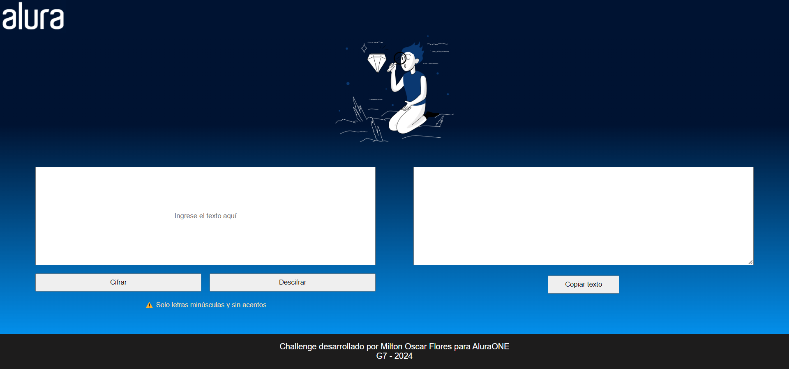
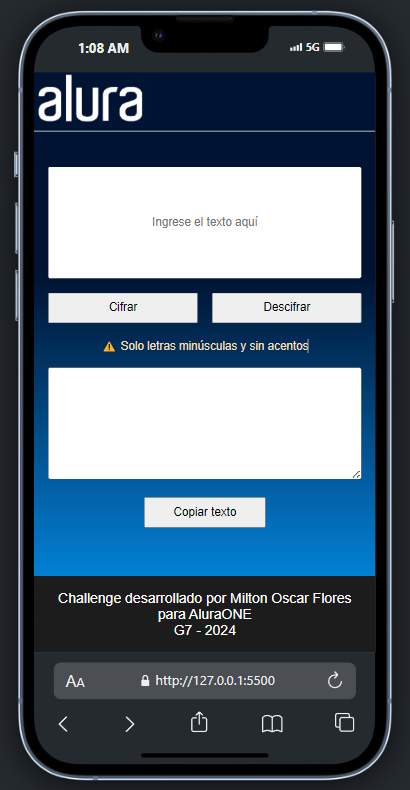
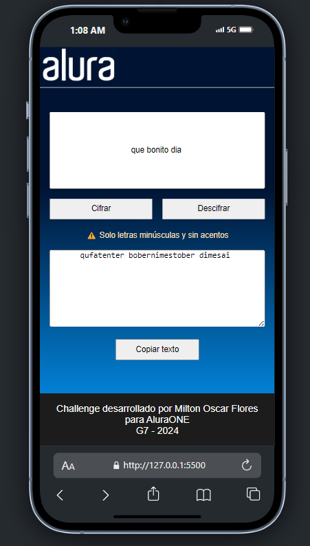
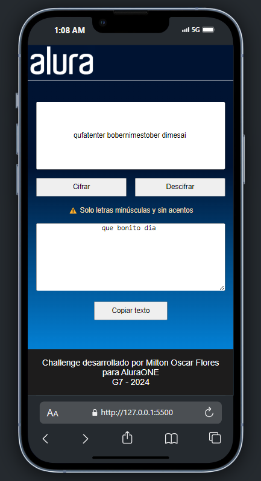

# Alura Encriptador

Challenge desarrollado para los cursos de Alura Oracle Backend. Esta aplicación permite encriptar y desencriptar textos utilizando un conjunto específico de reglas de sustitución de caracteres.

## Descripción

El encriptador funciona convirtiendo las letras a un código secreto basado en la siguiente tabla:

- La letra "e" se convierte en "enter"
- La letra "i" se convierte en "imes"
- La letra "a" se convierte en "ai"
- La letra "o" se convierte en "ober"
- La letra "u" se convierte en "ufat"

### Características

- Solo funciona con letras minúsculas.
- No se permiten acentos ni caracteres especiales.
- Opción para copiar el texto encriptado o desencriptado al portapapeles.

## Imágenes

A continuación se muestran algunas capturas de pantalla de la aplicación:


<div style="display: flex; justify-content: space-around;">
  
  
  
</div>


## Instalación y Uso

1. Clona el repositorio:
   ```bash
   git clone https://github.com/MiltonOscarFlores/alura-encriptador.git
